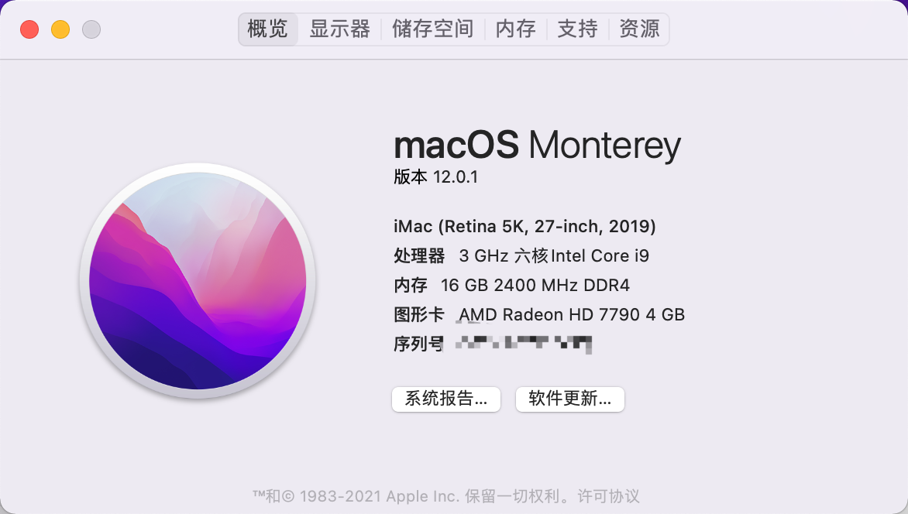
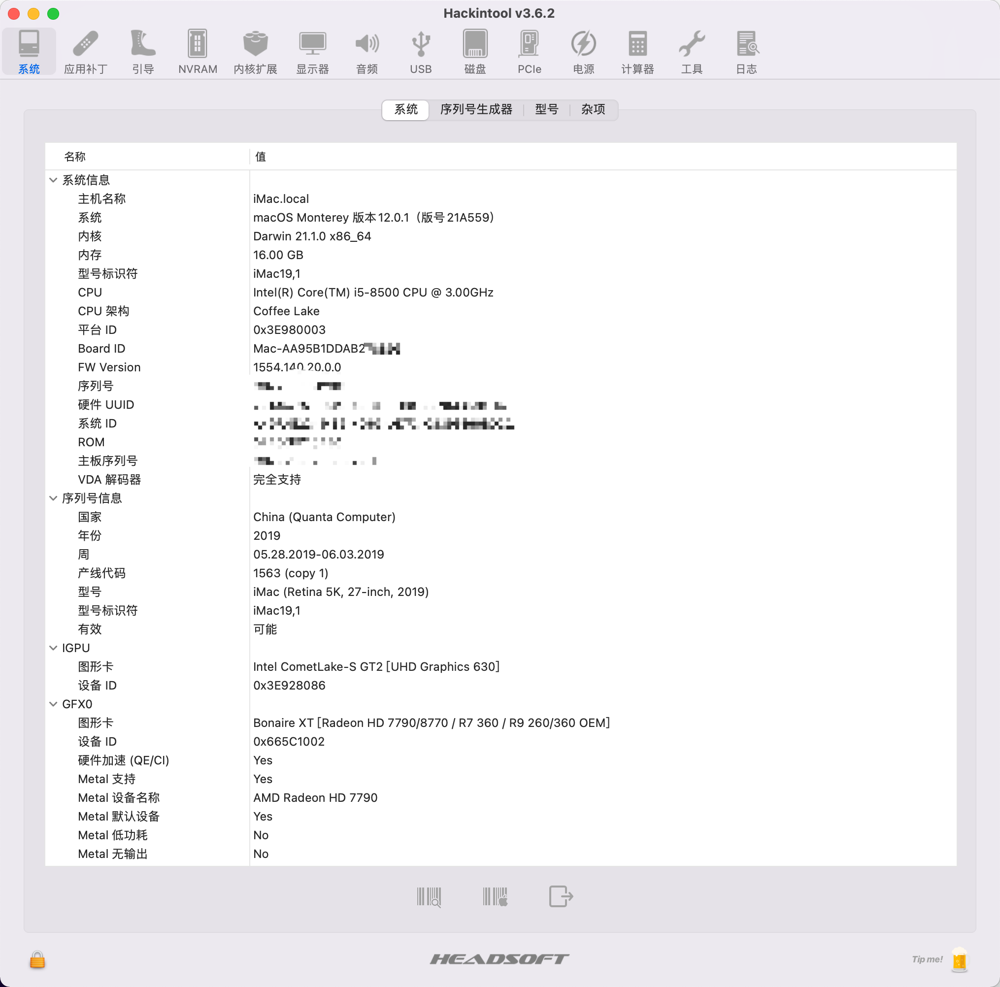
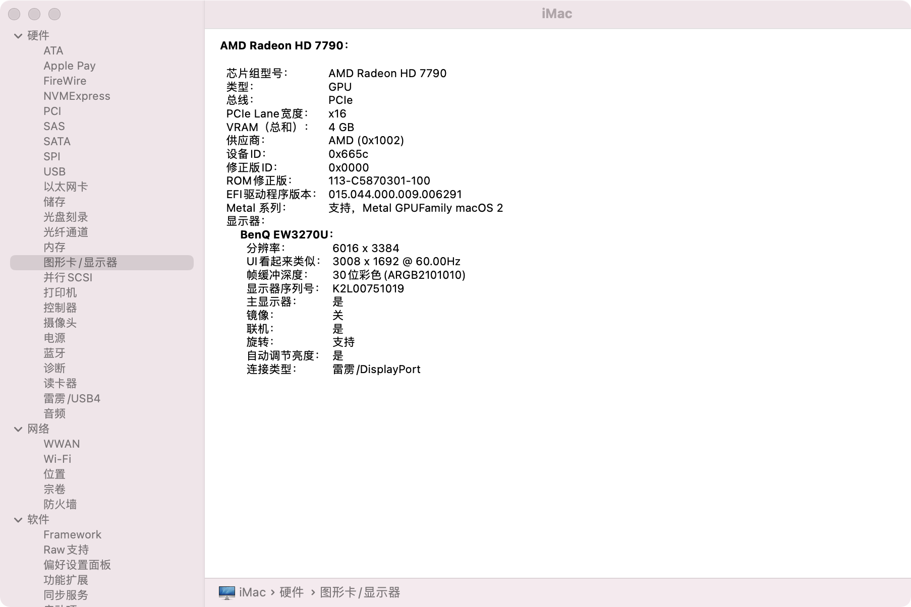
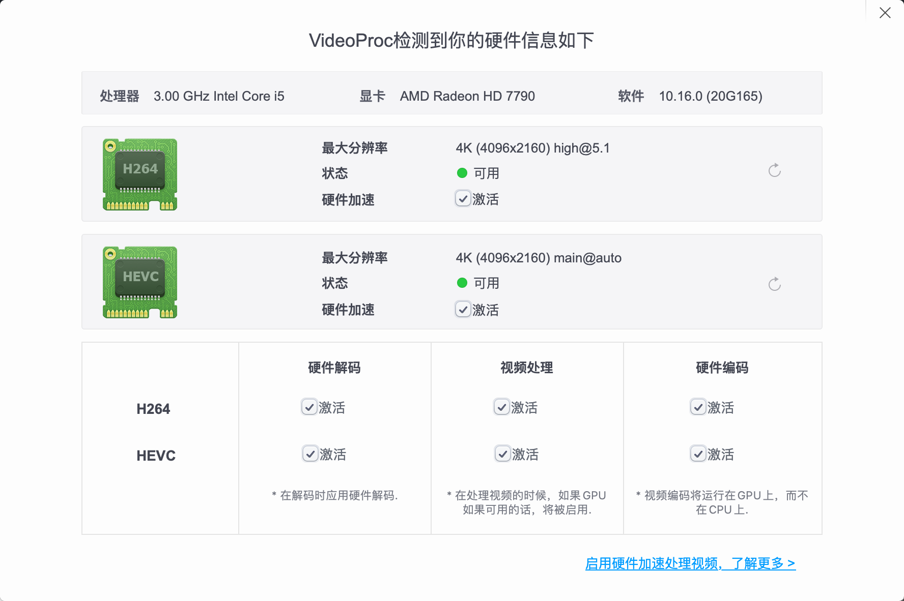

# MSI-B360M-MORTAR-Firepro-W5100-OpenCore

> 此项目efi基于：https://github.com/SuperNG6/MSI-B360-Big-Sur-EFI  AMD GPU+IGPU修改适配 AMD Firepro W5100 

# 硬件介绍
| 类型 | 品牌 | 型号 |
|-----|-----|-----|
| 处理器 | 英特尔| i5-8500 
| 主板 | 微星 | B360M MORTAR |
| 核显 | / | UHD630 |
| 显卡 | AMD | Firepro W5100 4G |
| 硬盘 | 三星 | 970evo 250G |
| 网卡 | 博通 | BCM94360CS2 |
| 显示器 |明基 | BenQ EW3270U 4k60hz 	|
| OS |	macOS Monterey 12.1 |
| OpenCorePkg | 0.7.6 |

# BIOS设置

确认主板使用的 BIOS 版本为`7B23v16` ，之后拔掉电源线并扣掉主板电池等十分钟后进行下面bios设置：

`SETTINGS`->`高级`->`内建显示配置`->`设置第一显卡 [PEG]`

`SETTINGS`->`高级`->`内建显示配置`->`集显共享内存 [64M]`

`SETTINGS`->`高级`->`内建显示配置`->`集成显卡多显示器 [允许]`

# 使用方法

下载整包后，使用 Clover Configurator v2.49.0.1（其他工具亦可）选择iMac19,1机型生成新的`三码` + `ROM`。
如果用 ProperTree 打开`/EFI/OC/config.plist`文件，填入到 `PlatformInfo` -> `Generic` 位置中

如果开机画面大小有问题的用工具更改`NVRAM`->`4D1EDE05-38C7-4A6A-9CC6-4BCCA8B38C14`->`UIScale`的值由`01`改为`02`即可，我设置成02的开机画面会变大，改01就正常了。

为方便修改信息附上OCC软件，使用时记得偏好设置一下版本属性，否则可能会报错！

# 截图

# 其他啥的后面有空继续补充。